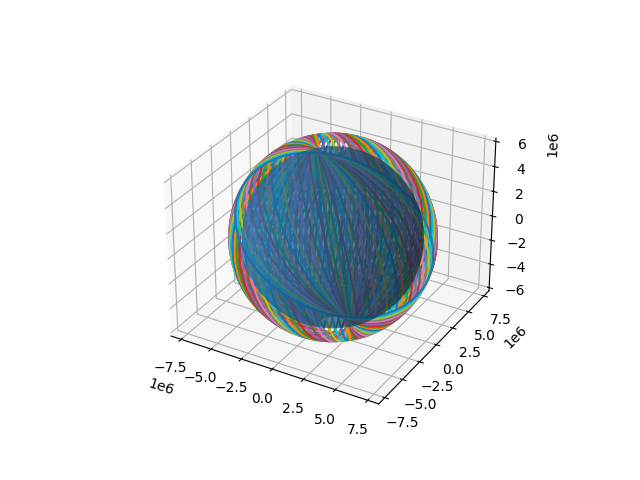
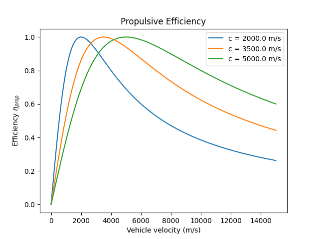

# aerospace-tools

A set of scripts for undergraduate-level aerospace engineering class work.

## Compressible Flow

The compressible flow scripts are inspired by the [Compressible Aerodynamics Calculator](https://www.engapplets.vt.edu/fluids/compresssibleAero/calc.html) and my interest in having something similar available on a TI-84 Plus CE-T Python Edition calculator.

## Orbits

### J2_Perturbations.py

## Other Projects

### max-q.py

The [max-q.py](Other%20Projects/max-q.py) script is a modified version of the script from chapter 3 of [_Python for Aerospace and Mechanical Engineering_ by Alex Kenan](https://github.com/alexkenan/pymae) which includes a pitch maneuver and acceleration calculations based on drag and vehicle mass as a function of time.

### rocket_propulsion.py

